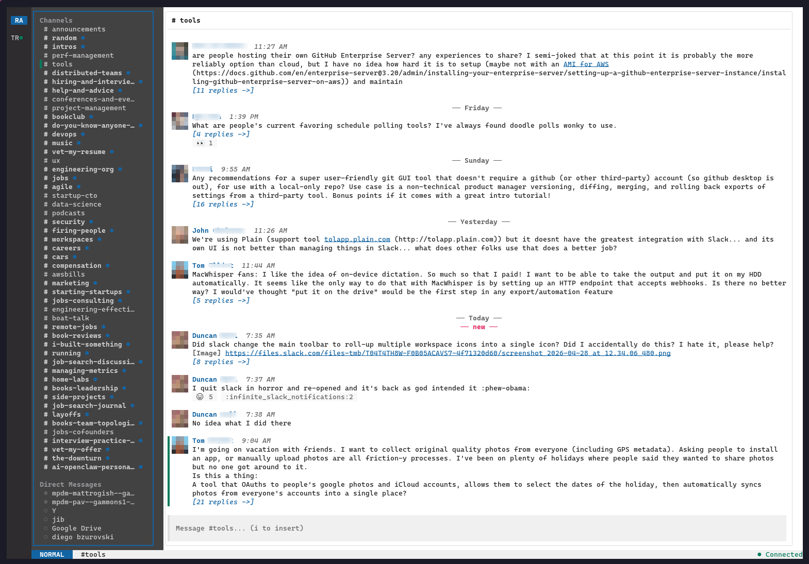

# slk

> **A blazingly fast Slack TUI.**
> Keyboard-driven, beautifully themed, and under 20MB. One static binary. No Electron required.
>
> Marketing site: [getslk.sh](https://getslk.sh)



`slk` is a daily-driver replacement for the official Slack desktop client, built in Go with [bubbletea](https://github.com/charmbracelet/bubbletea) and [lipgloss](https://github.com/charmbracelet/lipgloss). See [getslk.sh](https://getslk.sh) for the project homepage.

## Why slk?

- **Fast.** Cold start in milliseconds. Render-cached messages. SQLite-backed scrollback. Real-time over WebSocket.
- **Tiny.** ~19 MB on disk. ~60 MB RSS for a live multi-workspace session vs. 500 MB–1.5 GB for the official client. No node_modules, no Chromium, no 1Gb RAM tax.
- **Keyboard-first.** Vim-style modal editing. `j/k`, `h/l`, `i`, `Esc`
- **Pretty.** 12 built-in themes, lipgloss-styled panels, true-pixel avatars on kitty (half-block fallback elsewhere), emoji shortcodes, day separators, and pill-style reactions.
- **Multi-workspace.** All your workspaces stay connected in parallel. `1`–`9` to instantly jump between them, with live unread badges in the rail.
- **Yours.** TOML config, custom themes, custom channel sections via glob, XDG-compliant paths.

## Features

### Messaging
- Real-time messages, edits, deletes, reactions, and typing indicators over WebSocket
- Edit your own messages (`E`) — reuses the compose box with stash/restore for any in-progress draft
- Delete your own messages (`D`) — centered confirmation overlay with message preview
- Slack markdown rendering (bold, italic, strikethrough, code, blockquotes, links, mentions)
- Emoji shortcodes (`:rocket:` → 🚀)
- Day separators (Today, Yesterday, Monday, full date)
- Infinite scroll backfill into SQLite cache
- New-message landmark (red `── new ──` line at the unread boundary)
- Mark-as-read synced to Slack on channel entry
- Mark-as-unread (`U`) — rolls the read watermark backward to the selected message; thread replies supported. Inbound `channel_marked` / `thread_marked` events from other Slack clients are reflected live.
- Edited / threaded message indicators
- ANSI-aware wrapping and truncation (no broken color codes mid-line)
- Drag-to-copy: drag the mouse across messages to highlight them; release to copy plain text to the system clipboard via OSC 52

### Compose
- Multi-line input, `Shift+Enter` for newlines
- Inline `@mention` autocomplete (resolves to `<@UserID>` on send)
- Special mentions: `@here`, `@channel`, `@everyone`
- Bracketed paste — paste multi-line text from the system clipboard without it being interpreted as keystrokes
- Smart paste (`Ctrl+V`) — pastes a clipboard image as an attachment, or a copied file path as an attached file, or falls through to text. Multiple attachments + caption send together via Slack's V2 file-upload API. Note: use `Ctrl+V` (not your terminal's `Ctrl+Shift+V` paste shortcut) — terminal-initiated paste only delivers text, never image bytes.

### Images
- Inline image attachments render automatically in the messages pane: kitty graphics protocol on capable terminals (kitty, ghostty, recent WezTerm), sixel on foot/mlterm, half-block (`▀`) fallback everywhere else
- User avatars use the same kitty graphics path on capable terminals for sharper pixels; sixel and other terminals fall back to half-block
- Click any inline image (or press `O` on the selected message) for a full-screen in-app preview
- `Enter` from the preview launches the OS image viewer
- Lazy-loaded: images download only as they scroll into view
- LRU cache at `~/.cache/slk/images/` (default 200 MB cap)
- Inside tmux, slk falls back to half-block to avoid pixel-protocol pass-through pitfalls
- Configurable via `[appearance] image_protocol` (`auto` / `kitty` / `sixel` / `halfblock` / `off`) and `max_image_rows`

### Threads
- Side panel (35% width), opened with `Enter`, toggled with `Ctrl+]`
- Live thread reply routing, real-time updates
- Auto-closes on channel switch or narrow terminals
- **Threads view** (`⚑ Threads` at top of sidebar): scrollable list of every
  thread you authored, replied to, or were @-mentioned in for the active
  workspace. Unread first, then newest activity. Selecting a thread opens
  it in the side panel; the list re-ranks live as new replies arrive.
  v1 is computed from the local SQLite cache, so threads from channels
  you have not yet opened in slk will not appear until they are seen.

### Reactions
- Search-first picker overlay (`r`) with frecent emoji
- Quick-toggle nav across existing pills (`R`, then `h/l/Enter`)
- Pill-style display (green = yours, gray = others)
- Optimistic UI, deduped against the WebSocket echo

### Channels & Workspaces
- Three-panel layout: workspace rail, channel sidebar, message pane
- Public (`#`), private (`◆`), DM (`●`/`○` for presence), and group DM channels
- Sidebar order: pinned custom sections first, then Direct Messages, then the catch-all Channels list
- Collapsible sections — `Enter`/`Space` on a section header toggles it. The default Channels section starts collapsed (`▸ Channels •3` shows aggregate unreads); pinned sections and DMs start expanded
- Live unread indicators: bold + blue dot for unread channels, muted text for read ones, aggregate dot+count on collapsed section headers
- Custom channel sections via glob patterns in config
- Fuzzy channel finder (`Ctrl+t` / `Ctrl+p`) — auto-expands a collapsed section when you open a channel inside it; ranks 1:1 DMs above group DMs when searching by person name
- Workspace picker (`Ctrl+w`) and direct jump (`1`–`9`)
- All workspaces stay connected in parallel for live unread badges

### Notifications
- OS-level desktop notifications via [beeep](https://github.com/gen2brain/beeep)
- Triggers on DMs, mentions, and configurable keywords
- Suppressed when you're focused on the relevant channel
- Suppressed entirely while you're in DND/snooze

### Status & DND
- Set self presence (Active / Away) and DND/snooze from `Ctrl+S`
- Standard snooze durations (20m / 1h / 2h / 4h / 8h / 24h / until tomorrow morning) plus custom minutes
- Live status segment in the status bar with snooze countdown
- Reflects external state changes — set from the official Slack client or via your own API scripts — in real time over the WebSocket

### Connectivity
- Browser-cookie auth (`xoxc` + `d`) — works as any user, no Slack App required
- Direct connection to Slack's internal browser WebSocket protocol
- Auto-reconnect with exponential backoff (1s → 30s)
- Three-state connection indicator in the status bar

### Customization
- 12 built-in modern-looking themes
- Drop-in custom themes (`~/.config/slk/themes/*.toml`)
- Live theme switcher (`Ctrl+y`)
- TOML config for appearance, animations, notifications, and channel sections

## Terminal compatibility

slk works in any modern terminal, but the experience scales with what your
terminal supports. This table summarizes the important capabilities; pick
something from the top of the list for the richest experience.

| Terminal              | Inline images        | True-pixel avatars | OSC 8 links | OSC 52 clipboard | Notes                                                       |
|-----------------------|----------------------|--------------------|-------------|------------------|-------------------------------------------------------------|
| **kitty**             | kitty graphics       | yes                | yes         | yes              | Best overall experience. Older versions may need `clipboard_control write-clipboard`. |
| **ghostty**           | kitty graphics       | yes                | yes         | yes              | Recommended.                                                |
| **WezTerm** (recent)  | kitty graphics       | yes                | yes         | yes              |                                                             |
| **foot** (Wayland)    | sixel                | half-block         | yes         | yes              | Best Wayland-native option.                                 |
| **iTerm2 ≥ 3.5**      | half-block           | half-block         | yes         | yes              | Implements kitty graphics but not unicode placeholders, so slk falls back to half-block. |
| **Alacritty**         | half-block           | half-block         | yes (≥0.11) | yes              | Fast and reliable, but no inline images.                    |
| **gnome-terminal** (recent) | half-block     | half-block         | yes         | yes              |                                                             |
| **mlterm**            | sixel                | half-block         | partial     | partial          |                                                             |
| **screen**            | half-block           | half-block         | no          | no               | No working OSC 52 path; consider switching to tmux.         |

**Inside tmux:** slk forces half-block for inline images regardless of the
outer terminal — pixel-protocol pass-through inside tmux is unreliable. OSC 52
clipboard requires `set -g set-clipboard on` in your tmux config.

You can override slk's image-protocol pick via the `[appearance] image_protocol`
config key (`auto` / `kitty` / `sixel` / `halfblock` / `off`).

## Tradeoffs & Non-Goals

slk is intentionally not a 1:1 port of the desktop client. Some Slack features are deferred or out of scope:

**On the roadmap:**
- Slack-side search (`Ctrl+/` / `:search`)
- File uploads and downloads
- OSC 52 clipboard yank (`yy`)
- Quiet hours and per-channel mute
- Custom keybinding overrides

**Not planned:**
- Huddles, Slack Connect, Workflow Builder
- Bot/app management, slash commands, custom emoji management
- Animated reactions, link unfurls, in-app toasts

**Image rendering caveats:**
- iTerm2 ≥ 3.5 implements kitty graphics but does not support unicode placeholders, so it falls back to half-block.
- Animated GIFs render as a static first frame.
- Threads side panel renders attachments as text (`[Image] <url>`); inline rendering there is on the roadmap.
- Link unfurl image previews are not yet rendered inline.

**Auth caveat:** browser-cookie auth means tokens expire when you log out of the browser or Slack rotates them. Re-run `--add-workspace` and you're back in business.

**Unofficial / TOS caveat:** slk talks to Slack via the same internal browser protocol the official web client uses. This is unofficial and not sanctioned by Slack — using it may violate Slack's [API](https://slack.com/terms-of-service/api) and [user](https://slack.com/terms-of-service/user) Terms of Service, and Slack may break the protocol or invalidate tokens at any time. Use at your own risk on workspaces where that's acceptable to you and your admins.

## Install

Grab a prebuilt binary from the [latest release](https://github.com/gammons/slk/releases/latest), or use one of the methods below.

The shell snippets resolve the latest version automatically:

### Linux

**Debian / Ubuntu:**
```bash
VERSION=$(curl -fsSL https://api.github.com/repos/gammons/slk/releases/latest | grep -oE '"tag_name": *"v[^"]+"' | grep -oE 'v[0-9]+\.[0-9]+\.[0-9]+' | sed 's/^v//')
curl -fsSLO "https://github.com/gammons/slk/releases/latest/download/slk_${VERSION}_linux_amd64.deb"
sudo dpkg -i "slk_${VERSION}_linux_amd64.deb"
```

**Fedora / RHEL:**
```bash
VERSION=$(curl -fsSL https://api.github.com/repos/gammons/slk/releases/latest | grep -oE '"tag_name": *"v[^"]+"' | grep -oE 'v[0-9]+\.[0-9]+\.[0-9]+' | sed 's/^v//')
sudo rpm -i "https://github.com/gammons/slk/releases/latest/download/slk_${VERSION}_linux_amd64.rpm"
```

**Alpine:**
```bash
VERSION=$(curl -fsSL https://api.github.com/repos/gammons/slk/releases/latest | grep -oE '"tag_name": *"v[^"]+"' | grep -oE 'v[0-9]+\.[0-9]+\.[0-9]+' | sed 's/^v//')
curl -fsSLO "https://github.com/gammons/slk/releases/latest/download/slk_${VERSION}_linux_amd64.apk"
sudo apk add --allow-untrusted "slk_${VERSION}_linux_amd64.apk"
```

**Tarball (any distro, swap `x86_64` for `arm64` on ARM):**
```bash
VERSION=$(curl -fsSL https://api.github.com/repos/gammons/slk/releases/latest | grep -oE '"tag_name": *"v[^"]+"' | grep -oE 'v[0-9]+\.[0-9]+\.[0-9]+' | sed 's/^v//')
curl -fsSL "https://github.com/gammons/slk/releases/latest/download/slk_${VERSION}_linux_x86_64.tar.gz" | tar xz
sudo mv slk /usr/local/bin/
```

### macOS

```bash
VERSION=$(curl -fsSL https://api.github.com/repos/gammons/slk/releases/latest | grep -oE '"tag_name": *"v[^"]+"' | grep -oE 'v[0-9]+\.[0-9]+\.[0-9]+' | sed 's/^v//')
# Apple Silicon
curl -fsSL "https://github.com/gammons/slk/releases/latest/download/slk_${VERSION}_darwin_arm64.tar.gz" | tar xz
# Intel
curl -fsSL "https://github.com/gammons/slk/releases/latest/download/slk_${VERSION}_darwin_x86_64.tar.gz" | tar xz

sudo mv slk /usr/local/bin/
```

### Windows

Download the `windows_x86_64.zip` from the [latest release](https://github.com/gammons/slk/releases/latest), extract `slk.exe`, and add it to your `PATH`.

### Go

```bash
go install github.com/gammons/slk/cmd/slk@latest
```

### Build from source

Requires Go 1.22+.

On Linux, `Ctrl+V` paste-to-upload needs slightly different setup depending on your session type.

**X11 sessions** use the `golang.design/x/clipboard` library, which requires X11 development headers at build time:

- Debian/Ubuntu: `sudo apt-get install -y libx11-dev`
- Fedora/RHEL: `sudo dnf install -y libX11-devel`
- Arch: included in `xorg-server`

**Wayland sessions** bypass the X11 library entirely and shell out to `wl-paste` from the `wl-clipboard` package — install it for paste-to-upload to work:

- Debian/Ubuntu: `sudo apt-get install -y wl-clipboard`
- Fedora/RHEL: `sudo dnf install -y wl-clipboard`
- Arch: `sudo pacman -S wl-clipboard`

slk auto-detects the session via `WAYLAND_DISPLAY` at startup. On headless Linux (or when neither dependency is met), slk runs but `Ctrl+V` smart-paste is disabled.

```bash
git clone https://github.com/gammons/slk.git
cd slk
make build       # binary at bin/slk
```

### Verify your download

```bash
curl -fsSLO https://github.com/gammons/slk/releases/latest/download/checksums.txt
sha256sum -c checksums.txt --ignore-missing
```

## Setup

### 1. Log into Slack in your browser
Open [https://app.slack.com](https://app.slack.com) and sign into your workspace. Open the browser version of your slack workspace.

### 2. Grab your browser tokens

**The `d` cookie:**
- DevTools (F12 / Cmd+Option+I) → Application → Cookies → `https://app.slack.com`
- Copy the value of the cookie named `d`

**The `xoxc` token:** in the DevTools Console, run:
```javascript
Object.entries(JSON.parse(localStorage.localConfig_v2).teams).forEach(([id,t]) => console.log(t.name, t.token))
```
Copy the `xoxc-…` token for the workspace you want.

### 3. Add the workspace
```bash
./bin/slk --add-workspace
```
Or just run `./bin/slk`. Onboarding launches automatically when no workspaces are configured.

To remove a workspace later, run `./bin/slk --remove-workspace` for an interactive picker. This deletes the saved token from `~/.local/share/slk/tokens/`; your `config.toml` and SQLite cache are left untouched.

## Keybindings

| Key | Mode | Action |
|---|---|---|
| `j` / `k` | Normal | Move down/up in channel list or messages |
| `h` / `l` | Normal | Switch focus between panels |
| `Tab` / `Shift+Tab` | Normal | Cycle focus |
| `Enter` | Normal (sidebar) | Open selected channel, or toggle a section header |
| `Space` | Normal (sidebar) | Toggle the selected section header (collapse/expand) |
| `Enter` | Normal (message) | Open thread |
| `i` | Normal | Enter insert mode |
| `Esc` | Insert / Command | Return to normal mode |
| `Enter` | Insert | Send message |
| `Shift+Enter` | Insert | Newline |
| `Ctrl+V` | Insert | Smart paste — image / file path / text (use `Ctrl+V`, not the terminal's `Ctrl+Shift+V`) |
| `Ctrl+U` | Insert | Clear compose (text + pending attachments) |
| `Ctrl+U` / `Ctrl+D` | Normal | Half-page up / down |
| `Up` | Insert | Previous line; on the first line, jump to start of message |
| `Down` | Insert | Next line; on the last line, jump to end of message |
| `gg` / `G` | Normal | Jump to top / bottom |
| `Ctrl+b` | Any | Toggle sidebar |
| `Ctrl+]` | Any | Toggle thread panel |
| `Ctrl+t` / `Ctrl+p` | Any | Fuzzy channel finder |
| `Ctrl+w` | Any | Workspace picker |
| `1`–`9` | Normal | Jump to workspace N |
| `r` | Normal (message) | Open reaction picker |
| `R` | Normal (message) | Quick-toggle existing reactions |
| `E` | Normal (message) | Edit your own message |
| `D` | Normal (message) | Delete your own message (with confirmation) |
| `U` | Normal (message) | Mark selected message and everything newer as unread |
| `Y` / `C` | Normal (message) | Copy message permalink |
| `O` / `v` | Normal (message) | Open full-screen image preview |
| `Esc` / `q` | Preview | Close preview |
| `Enter` | Preview | Open in system image viewer |
| `h` / `←` | Preview | Previous image (when message has multiple) |
| `l` / `→` | Preview | Next image (when message has multiple) |
| Click | Any (on image) | Open full-screen preview |
| `Ctrl+y` | Any | Switch theme |
| `Ctrl+s` | Any | Set status (Active / Away / DND snooze) |
| `q` | Normal | Quit (with confirmation) |
| `Q` | Normal | Quit immediately |
| `Ctrl+c` | Any | Quit (with confirmation) |

## Configuration

Config lives at `~/.config/slk/config.toml`:

```toml
[general]
default_workspace = "work"   # the slug, not the team ID

[appearance]
theme = "dracula"
timestamp_format = "3:04 PM"
image_protocol = "auto"   # auto | kitty | sixel | halfblock | off
max_image_rows = 20       # cap inline image height in terminal rows

[animations]
enabled = true
smooth_scrolling = true
typing_indicators = true

[notifications]
enabled = true
on_mention = true
on_dm = true
on_keyword = ["deploy", "incident"]
quiet_hours = "22:00-08:00"   # planned

[cache]
message_retention_days = 30
max_db_size_mb = 500
max_image_cache_mb = 200

# Global channel sections (used as a fallback for workspaces that
# don't define their own).
[sections.Alerts]
channels = ["alerts", "ops", "*-alerts"]
order = 1

# Per-workspace settings: keyed by a slug you choose at --add-workspace
# time. team_id ties the slug to the underlying Slack workspace.
[workspaces.work]
team_id = "T01ABCDEF"
order   = 1                  # rail position; 1-based, used by 1-9 keys
theme   = "dracula"          # overrides [appearance].theme

[workspaces.work.sections.Alerts]
channels = ["alerts", "*-alerts"]
order = 1

[workspaces.work.sections.Engineering]
channels = ["eng-*", "deploys"]
order = 2

# A second workspace with no per-workspace sections — falls back to
# the global [sections.*] above.
[workspaces.side]
team_id = "T02XYZ"
order   = 2

# Inline color overrides on top of the active theme
[theme]
primary = "#4A9EFF"
accent = "#50C878"
background = "#1A1A2E"
text = "#E0E0E0"
```

Per-workspace `[workspaces.<slug>.sections.*]` blocks fully replace the
global `[sections.*]` for that workspace. Workspaces that define no
sections of their own fall back to the global table.

The `order` field controls workspace position in the rail and the
mapping for the `1`–`9` digit keys. Positive values sort ascending
(lowest first); workspaces without an `order` (or with `order = 0`)
sort after explicitly ordered ones, alphabetically by slug. Tokens
on disk that have no `[workspaces.<slug>]` block at all sort last,
alphabetically by team ID. The order is stable across runs.
Previously the rail order depended on which workspace's WebSocket
connected first; it is now deterministic regardless of network
timing, even without an explicit `order` set.

Legacy configs that key the block by raw team ID
(`[workspaces.T01ABCDEF]`) keep working unchanged.

### Custom themes

Drop `.toml` files into `~/.config/slk/themes/`:

```toml
name = "My Theme"

[colors]
primary      = "#BD93F9"
accent       = "#50FA7B"
warning      = "#FFB86C"
error        = "#FF5555"
background   = "#282A36"
surface      = "#343746"
surface_dark = "#21222C"
text         = "#F8F8F2"
text_muted   = "#6272A4"
border       = "#44475A"

# Optional sidebar/rail overrides — lets you have a darker sidebar with a
# lighter message pane (Slack's default look). Fall back to
# background/text/text_muted/surface_dark when omitted.
sidebar_background = "#19171D"
sidebar_text       = "#D1D2D3"
sidebar_text_muted = "#9A9B9E"
rail_background    = "#19171D"
```

### Data paths (XDG)

| Path | Contents |
|---|---|
| `~/.config/slk/` | Configuration, custom themes |
| `~/.local/share/slk/` | SQLite cache, tokens |
| `~/.cache/slk/` | Avatars, image cache |

## Architecture

Service-oriented, four layers:

```
UI Layer (bubbletea)   workspace rail · sidebar · messages · thread · compose · status bar
Service Layer          WorkspaceManager · MessageService · ConnectionManager
Client Layer           Slack Web API + browser-protocol WebSocket
Data Layer             SQLite cache · TOML config · token storage
```

- ~9,300 lines of Go across 31 source files and 24 test files
- SQLite is a cache, not the source of truth — Slack remains authoritative
- Render cache + bubbles/viewport for snappy scrolling
- muesli/reflow everywhere for ANSI-correct wrapping and truncation

See [`docs/superpowers/specs/`](docs/superpowers/specs/) for design specs and [`docs/STATUS.md`](docs/STATUS.md) for the live implementation status.

## Clipboard / OSC 52 caveats

slk writes the system clipboard via the OSC 52 escape. Most modern
terminal emulators (alacritty, kitty, wezterm, foot, iterm2, recent
gnome-terminal) accept these writes by default. A few need explicit
opt-in:

- **tmux:** `set -g set-clipboard on` in your tmux config.
- **screen:** has no working OSC 52 path; consider switching to tmux.
- **kitty (older versions):** `clipboard_control write-clipboard` in
  `kitty.conf`.

If `Copied N chars` shows in the status bar but nothing lands in your
clipboard, your terminal is silently dropping the OSC 52 write. There
is no reliable round-trip to detect this from inside slk.

## Disclaimer

`slk` is an independent, unofficial project. It is not affiliated with, endorsed by, or sponsored by Slack Technologies, LLC or Salesforce, Inc. "Slack" is a trademark of Slack Technologies, LLC; it is used here only to describe the service this client interoperates with.

## License

[MIT](LICENSE) © Grant Ammons
